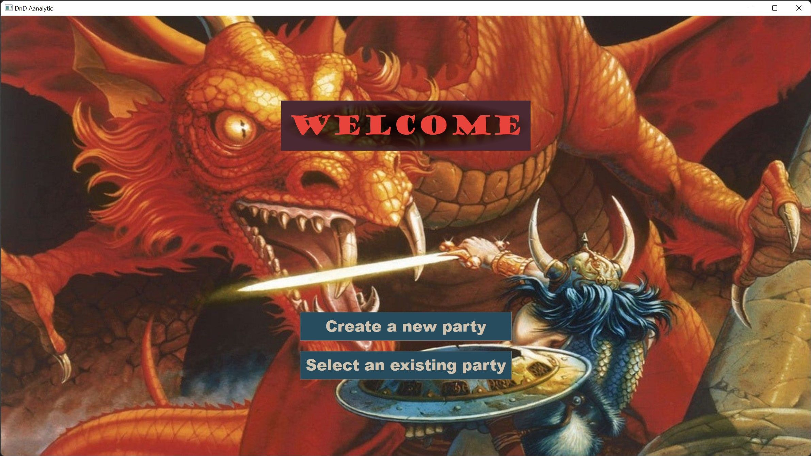
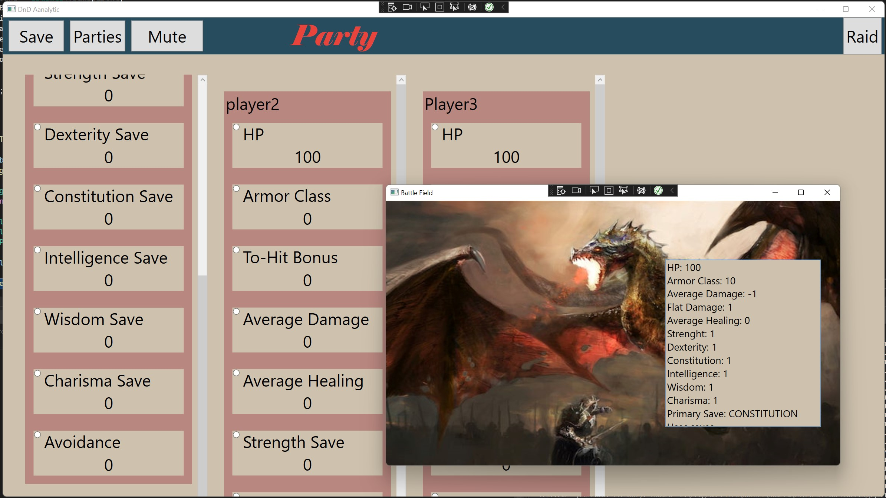

# Oculus Party Viewer
This is a game that allows players to view and record team stats during an Oculus party. It was developed using C#, .NET, and WPF, and it features a boss fight mode where the boss's health and abilities are calculated based on the current player's stats.

# Usage
To start the game, simply run the executable file. You will be taken to the game's main menu, where you can select create a new party or load a previous game.. You can also enable boss fight mode, which will calculate the boss's health and abilities based on the current player's stats.

The game also allows you to save the team stats to a file that can be opened later.

# Technologies Used
- C#: Used to develop the game's core functionality and game engine.
- .NET & WPF: Used to create the game's UI, including menus, buttons, and other graphical elements.

# Credits
This game was developed by myself and my teammate Mazin.

